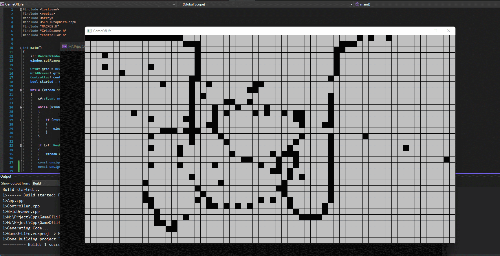

# GameOfLife

# Introduction

Conway's Game of Life or Life or GOF is a Cellular automated game
created by British mathematician John Conway in 1970 in which a cell in a grid is alive or dead.
Each Cell's next generation state is determined by the current state of its 8 neighbours 
(up, left, down, right, upleft, downright, downleft, upright).
The Game future states depends solely on its initial state.

# Rules

if a Cell is Dead : 

    it will be alive in the next generation(step) if it has exactly 3 alive neighhours 

if a Cell is Alive :

    it will die if it has 4 or more alive neighbours due to overpopulation.

    it will die if it has 1 or less alive neighbours due to underpopulation.

    it will continue to live to the next generation if it has 2 or 3 alive neighbours.
    
  
# Why it is Important
  
  The Game of Life is Undecidable.
  A person cannot logically or mathematically predict exactly the future state of the game
  over a finite amount of time.
  It is very interseting and fun way to show and discuss undecidability in Mathematics.
        
[More on Undecidability](https://en.wikipedia.org/wiki/Undecidable_problem)  
[More on Conway's Game of Life](https://en.wikipedia.org/wiki/Conway%27s_Game_of_Life)
        
     
  
  
 
